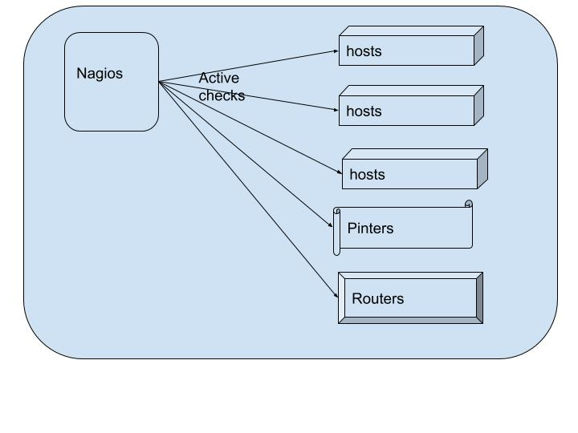
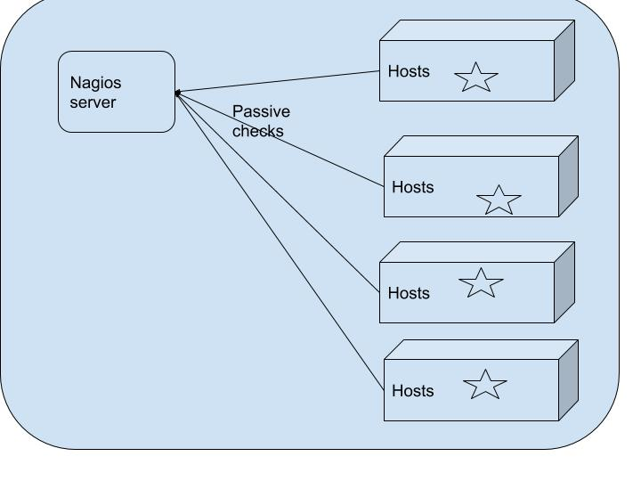
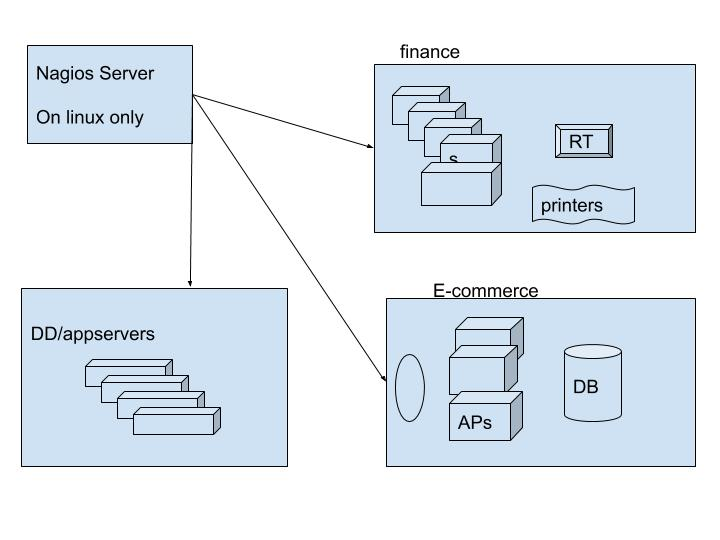

# System Monitoring:

## checks
  * active checks
     * any ping ble device,we can able monitor.
     
  * passive checks
     * we install agent on each host
     

## By using system monitoring 

    * it can monitor individually 
    * it can monitor groups

    
g)

   

## install and configure nagios
   * nagios3 : open sources 
   * nagios4 : open sources
   * nagios XI : not open sources

## install nagios3:
   * use ubuntu 16 
   * install LAMP by tasksel
   * install nagios3

### config nagios3

  ```
    1  apt-get update
    2  apt-get install tasksel
    3  tasksel
    4  apt-get install nagios3
    
    http://34.228.216.230/nagios3/

  ```
### install nagios4
 * download and install and compile code.
 * download plugin's and compile code.
 * configure my host server  into nagios4

 [installnagios](https://support.nagios.com/kb/article/nagios-core-installing-nagios-core-from-source-96.html#Ubuntu)

```
in nagios.cfg  file, we should edit as below
cfg_file=/usr/local/nagios/etc/objects/host1.ip-172-31-91-95.ec2.internal.cfg


/usr/local/nagios/nagios -v /usr/local/nagios/etc/nagios.cfg
sudo systemctl restart nagios.service


```
 